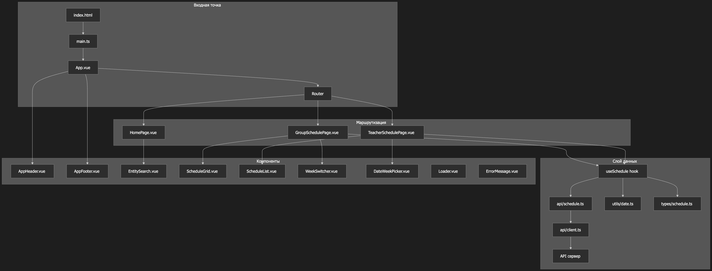

# Schedule Viewer — просмотр университетского расписания

Приложение на Vue 3 + TypeScript + Vite для просмотра университетского расписания по группе или преподавателю. Данные загружаются из внешнего REST API с Bearer-авторизацией.

## Установка и запуск

```bash
npm install
npm run dev
```

После запуска откройте `http://localhost:5173` в браузере.

## Конфигурация API

Создайте файл `.env` в корне проекта и укажите базовый URL вашего API и токен авторизации:

```bash
VITE_API_BASE_URL=https://api.example.com
VITE_API_TOKEN=your_bearer_token_here
```

По умолчанию используется токен из исходного кода (для разработки). В продакшене обязательно используйте переменную окружения.

## API эндпоинты

Приложение использует следующие эндпоинты:

### Группы
- `GET /api/v1/groups/{group}` — получить группу по названию
- `GET /api/v1/groups/search?course={course}&level={level}` — поиск групп
- `GET /api/v1/groups/schedule?group={group}&weekCount={weekCount}` — расписание группы

### Преподаватели
- `GET /api/v1/teachers/{teacher}` — получить преподавателя по ФИО
- `GET /api/v1/teachers/search?department={department}` — поиск преподавателей
- `GET /api/v1/teachers/schedule?teacher={teacher}&weekCount={weekCount}` — расписание преподавателя

### Конфигурация
- `GET /api/v1/configuration/week` — получить текущую четность недели (1 или 2)

Все запросы требуют заголовок `Authorization: Bearer {token}`.

## Основные экраны

- **Домашняя страница** — выбор типа расписания (группа / преподаватель) и ввод названия группы или ФИО преподавателя
- **Страница расписания группы** — недельное расписание выбранной группы с переключением между четной/нечетной неделей
- **Страница расписания преподавателя** — недельное расписание выбранного преподавателя

На десктопе расписание показывается в виде недельной сетки, на мобильных устройствах — как список пар по дням. Предусмотрены переключение между четной/нечетной неделей, индикатор загрузки и вывод ошибок API.

## Формат данных

- **Группа**: точное название, например `25-СПО-ИСИП-01`
- **Преподаватель**: полное ФИО, например `Иванов И.И.`
- **Четность недели**: 1 (нечетная) или 2 (четная), определяется автоматически из API

## Архитектура проекта

### Структура директорий

```
schedule-viewer/
├── public/                 # Статические ресурсы
├── src/
│   ├── api/               # Слой работы с API
│   │   ├── client.ts      # HTTP-клиент
│   │   ├── config.ts      # Конфигурация API
│   │   └── schedule.ts    # Функции запросов расписания
│   ├── assets/            # Изображения и иконки
│   ├── components/        # Vue-компоненты
│   │   ├── common/        # Loader, ErrorMessage
│   │   ├── filters/       # EntitySearch
│   │   ├── layout/        # AppHeader, AppFooter
│   │   └── schedule/      # ScheduleGrid, ScheduleList, WeekSwitcher, DateWeekPicker
│   ├── hooks/             # Композиции Vue (useSchedule)
│   ├── pages/             # Страницы приложения
│   │   ├── HomePage.vue
│   │   ├── GroupSchedulePage.vue
│   │   └── TeacherSchedulePage.vue
│   ├── types/             # TypeScript-типы (schedule.ts)
│   ├── utils/             # Вспомогательные утилиты (date.ts)
│   ├── App.vue            # Корневой компонент
│   ├── main.ts            # Точка входа
│   ├── router.ts          # Маршрутизация
│   └── style.css          # Глобальные стили
├── index.html             # HTML-шаблон
├── vite.config.ts         # Конфигурация Vite
├── package.json           # Зависимости
└── tsconfig*.json         # Конфигурация TypeScript
```

### Диаграмма архитектуры



### Ключевые модули

1. **Точка входа** (`main.ts`) – инициализация Vue, Vue Router, Vuetify.
2. **Маршрутизация** (`router.ts`) – три маршрута: главная, расписание группы, расписание преподавателя.
3. **Слой API** – `api/client.ts` (универсальный HTTP-клиент), `api/schedule.ts` (специфичные запросы), `api/config.ts` (конфигурация).
4. **Типы данных** (`types/schedule.ts`) – TypeScript-интерфейсы для групп, преподавателей, расписания.
5. **Композиция Vue** (`hooks/useSchedule.ts`) – центральная логика загрузки расписания, управления состоянием, навигации по неделям.
6. **Утилиты** (`utils/date.ts`) – функции для работы с датами, парсинга времени, вычисления недельных диапазонов.
7. **Компоненты** – разделены по ответственности: layout, filters, schedule, common.
8. **Стили** (`style.css`) – глобальные CSS-переменные, поддержка светлой/тёмной темы.

### Поток данных

1. Пользователь выбирает группу/преподавателя на главной странице.
2. Приложение переходит на страницу расписания.
3. Страница использует хук `useSchedule`, который загружает данные через API.
4. Данные трансформируются и передаются в компоненты отображения (ScheduleGrid/ScheduleList).
5. Пользователь может переключать недели с помощью WeekSwitcher или DateWeekPicker.
6. Загруженные расписания сохраняются в `localStorage` как "недавние".

### Зависимости

- **Vue 3** – фреймворк.
- **Vue Router** – маршрутизация.
- **Vuetify 3** – UI-компоненты.
- **TypeScript** – типизация.
- **Vite** – сборка и dev-сервер.
- **@mdi/font** – иконки Material Design.

### Особенности

- Адаптивный дизайн с поддержкой мобильных устройств.
- Автоматическое определение текущей чётности недели с сервера.
- Проксирование API в dev-режиме для обхода CORS.
- Сохранение истории просмотров в localStorage.
- Плавные переходы между страницами.

Архитектура проекта следует принципам модульности и разделения ответственности: слой API отделён от UI, бизнес-логика вынесена в хуки, компоненты переиспользуемы.
